# Inspirite
A blogging platform with a creative writing twist

## Summary Description
Inspirite offers the user a writing prompt in form of a randomly generated quote, image, fact, or GIF. The writing can be saved in the user's history and accessed on the saved writing page. Completed blogs can be accessed on the published work page. A writing streak counter encourages the aspiring writer to hang in there and keep their writing pratice going.

- It serves a daily writing prompt to the user, to inspire them to write. The prompts can take the form of a quote, a fun fact, a GIF etc.

- It offers a simple, no distraction interface with focus on creative writing. 

- It displays the number of consecutive days of use.

- It stores users' writing and allows for browsing of saved and published work.

## User story

As an aspiring writer:

- I want to practise creative writing every day.
- I want to be inspired to write on a variety of topics.
- I want to keep track of my progress.

Who is the target audience?
- Anyone who wants to practise their creative writing skills daily.
- Anyone looking for writing prompts and inspiration.
- Anyone who wants to keep track of their progress in creative writing.

What is the problem that it addresses?
- Consistently practising creative writing can be challenging. 
- It’s easy to lose track of one's progress.
- Finding inspiration for creative writing can be difficult.
- Having instant, easy access to previously written texts is desirable.

How does the product solve that problem?
- Inspirite provides a simple-to-use platform to practise creative writing daily.
- It prompts the users to write creatively.
- It keeps track of the users’ progress (writing streaks), motivating them to write consistently. 
- It stores previously written texts and lets the user search for specific tags.

## Technology
### HTML
Added links to Google Fonts, Bootstrap, links in the footer and Jumbotron. Added a second HTML file to store the user's record of daily writing submissions.

### CSS
Styling elements to buttons, cards, header, footer and jumbotron are applied.

### JavaScript
Used MomentJS to access current time stamp, retrieve information from Giphy and Ninja API, as well as jQuery calls to dynamically create elements in DOM for randomly generated GIF, images, quotes and facts.

### Bootstrap
Navbar, jumbotron, buttons, and cards from bootstrap are applied and customised for the app.

### Third-party and server-side APIs
jQuery and Moment are used. Giphy and ninja APIs data are used for prompts. 

## Installation
The website can be accessed follwing the link to the application page:
https://dr-jingyuezhao.github.io/blog-inspirite/

GitHub Repo: https://github.com/dr-jingyuezhao/blog-inspirite
GitHub Page: https://dr-jingyuezhao.github.io/blog-inspirite/

## Usage
When opening the app in the browser, the user will be presented with the home page and asked to choose an inspiration. There are four buttons for generating different types of prompts: famous quote, fun fact, random picture, and gif surprise. The user can also click on the saved writing and published work link in the navbar to access the data in the local storage. After the user clicks on a button for a specific type of prompt, data from server API will be displayed on the top of the page based on the prompt type. A text input box will be generated below and the user can start writing. The user can switch on or off the sound effect while writing. When the user finishes writing, the user can delete, save, or publish the work by clicking each button. A modal will pop up to ask the user to confirm the action. When the user confirms to discard, the text in the input box will be deleted. When the user confirms to save or publish, the writing will be saved using localStorage in two different formats. The user can go to the saved writing page and click on a saved writing record to continue writing. The user can also go to the published work page and click on a published blog to retrieve the stored data and read more about that writing.

### Website demo
The following screenshots demonstrate the web application's appearance and functionality:

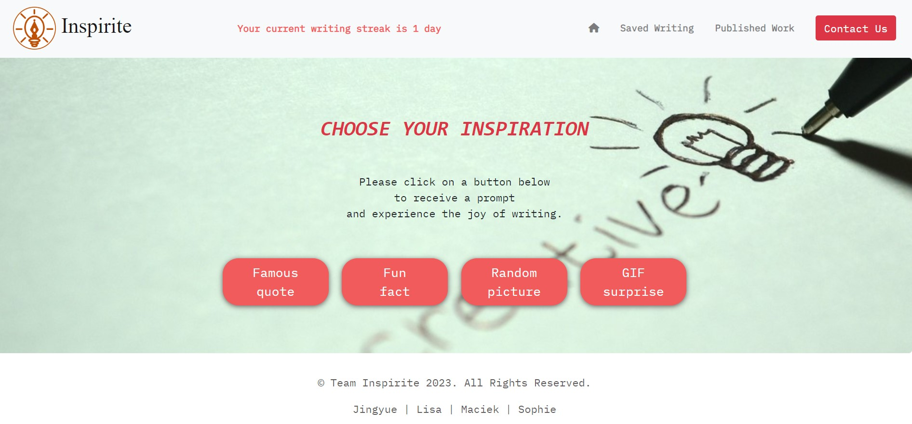
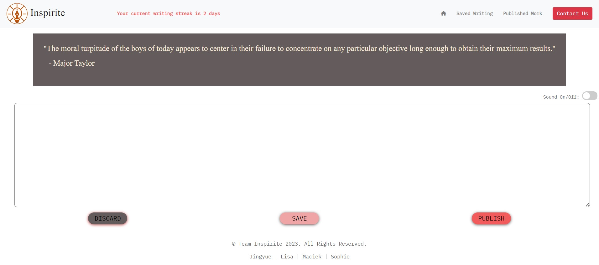
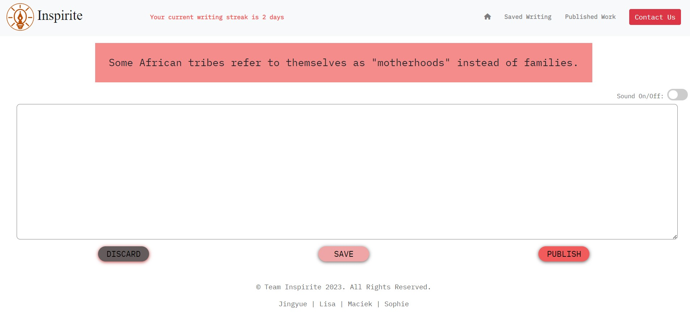
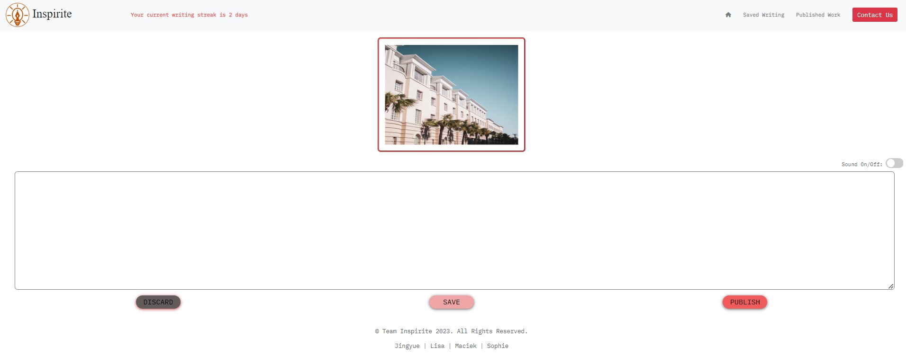
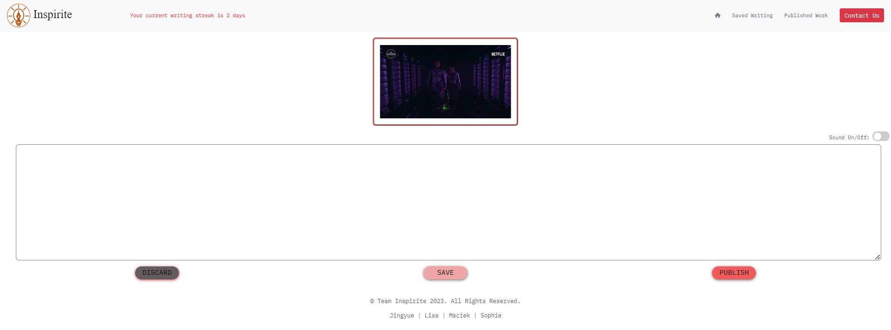
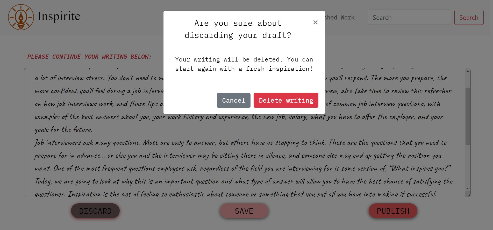
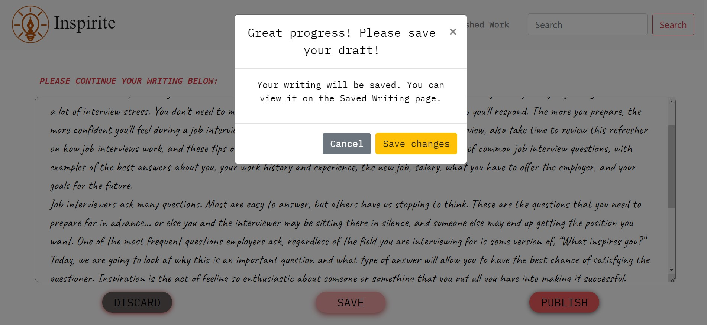
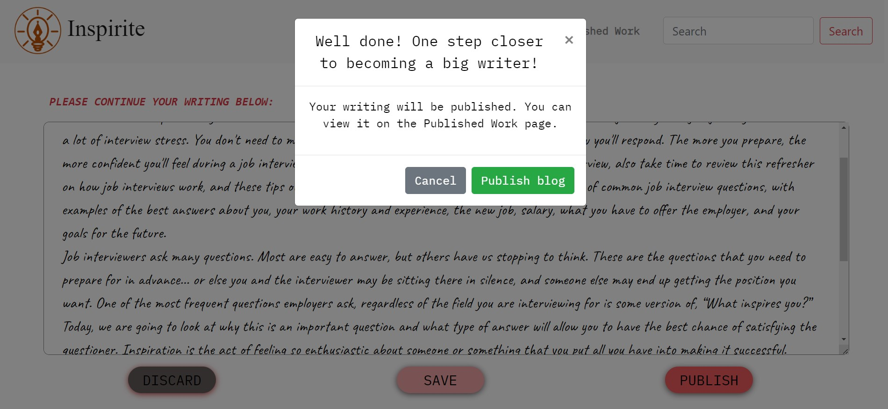
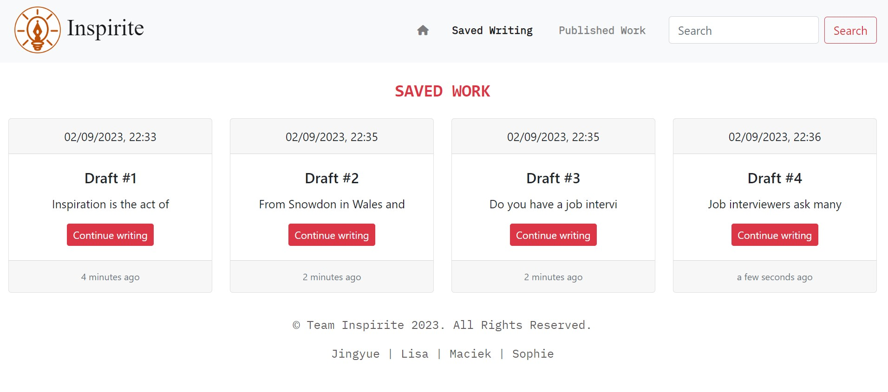
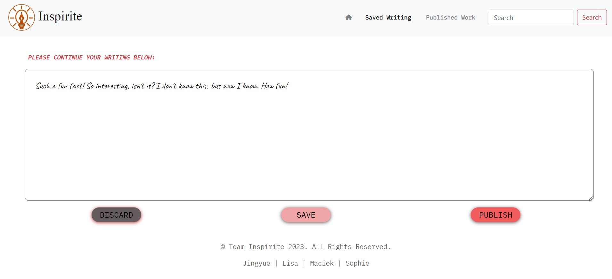
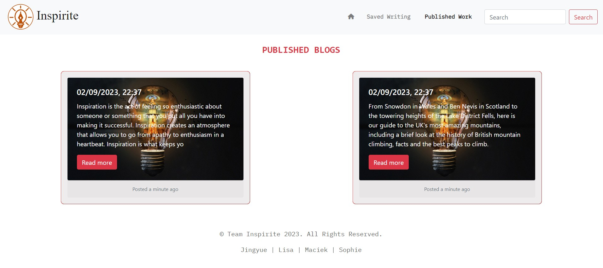
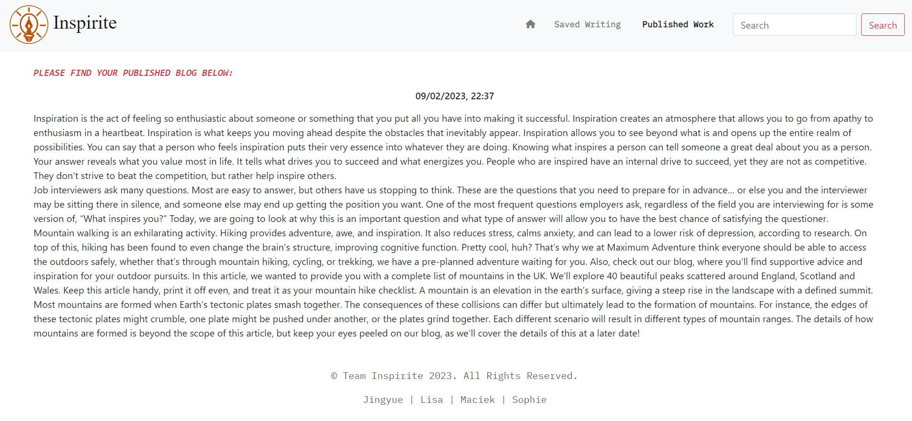

## Project documents
- Proposal
https://docs.google.com/document/d/1_e-iMsE5rRu6HXCnrnoc4OajT5UvslIOAEcLzokCVnM/edit?usp=sharing
https://drive.google.com/file/d/1brsqEuIZ28dgOupK-QWiErJAWuNk4cC-/view?usp=sharing
- Presentation
https://github.com/dr-jingyuezhao/blog-inspirite/blob/main/assets/docs/Inspirite_presentation-9-Feb-23.pdf

## Credits
Sophie https://github.com/sophiedodsworth | Maciek https://github.com/manonthemon | Jingyue https://github.com/dr-jingyuezhao | Lisa https://github.com/LisaMLorenz

## License

MIT License

Copyright (c) 2023 Jasmine

Permission is hereby granted, free of charge, to any person obtaining a copy
of this software and associated documentation files (the "Software"), to deal
in the Software without restriction, including without limitation the rights
to use, copy, modify, merge, publish, distribute, sublicense, and/or sell
copies of the Software, and to permit persons to whom the Software is
furnished to do so, subject to the following conditions:

The above copyright notice and this permission notice shall be included in all
copies or substantial portions of the Software.

THE SOFTWARE IS PROVIDED "AS IS", WITHOUT WARRANTY OF ANY KIND, EXPRESS OR
IMPLIED, INCLUDING BUT NOT LIMITED TO THE WARRANTIES OF MERCHANTABILITY,
FITNESS FOR A PARTICULAR PURPOSE AND NONINFRINGEMENT. IN NO EVENT SHALL THE
AUTHORS OR COPYRIGHT HOLDERS BE LIABLE FOR ANY CLAIM, DAMAGES OR OTHER
LIABILITY, WHETHER IN AN ACTION OF CONTRACT, TORT OR OTHERWISE, ARISING FROM,
OUT OF OR IN CONNECTION WITH THE SOFTWARE OR THE USE OR OTHER DEALINGS IN THE
SOFTWARE.